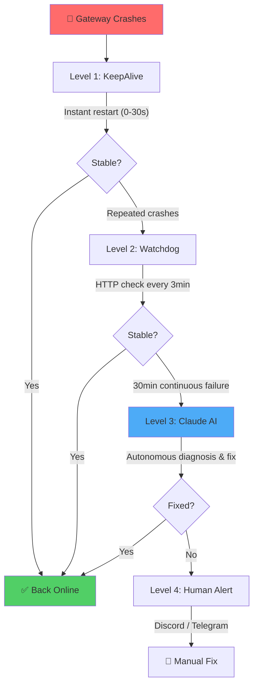

<div align="center">

# 🦞 OpenClaw Self-Healing System

### *Autonomous AI-Powered Recovery for Production Services*

**Stop getting paged at 3 AM. Let AI fix your crashes automatically.**

[](https://github.com/Ramsbaby/openclaw-self-healing/releases)
[](#-quick-start)
[](LICENSE)
[](https://github.com/ramsbaby/openclaw-self-healing/stargazers)

[🚀 Quick Start](#-quick-start) · [🎬 Demo](#-demo) · [🏗️ Architecture](#️-architecture) · [📖 Docs](docs/)

</div>

---

## 🎬 Demo

<div align="center">


*4-tier recovery in action: KeepAlive → Watchdog → AI Doctor → Alert*

</div>

---

## 🔥 Why This Exists

Your OpenClaw Gateway crashes at midnight. A basic watchdog restarts it — but what if the config is corrupted? The API rate limit hit? A dependency broken?

**Simple restart = crash loop.** You get paged. Your weekend is ruined.

**This system doesn't just restart — it understands and fixes root causes.**

---

## 🚀 Quick Start

### Prerequisites

- **macOS 12+** or **Linux** (Ubuntu 20.04+ / systemd)
- **[OpenClaw Gateway](https://github.com/openclaw/openclaw)** installed and running
- **[Claude CLI](https://docs.anthropic.com/claude/docs/claude-code)** with Anthropic API key
- `tmux`, `jq` (`brew install tmux jq` or `apt install tmux jq`)

### Install (5 minutes)

```bash
curl -fsSL https://raw.githubusercontent.com/ramsbaby/openclaw-self-healing/main/install.sh | bash
```

The installer walks you through everything:

```
╔═══════════════════════════════════════════════╗
║  🦞 OpenClaw Self-Healing System Installer    ║
╚═══════════════════════════════════════════════╝

[1/6] Checking prerequisites...          ✅
[2/6] Creating directories...            ✅
[3/6] Installing scripts...              ✅
[4/6] Configuring environment...
      Discord webhook URL (optional): https://discord.com/api/webhooks/...
      Gateway port [18789]: 
      Gateway token (auto-detected): ✅
[5/6] Installing Watchdog LaunchAgent... ✅
[6/6] Verifying installation...
      Health check: HTTP 200 ✅
      Chain: Watchdog → HealthCheck → Emergency Recovery ✅

🎉 Self-Healing System Active!
```

### Verify It Works

```bash
# Kill your Gateway to test auto-recovery
kill -9 $(pgrep -f openclaw-gateway)

# Wait ~30 seconds, then check
curl http://localhost:18789/
# Expected: HTTP 200 ✅
```

---

## 🎬 How It Works

### 4-Tier Autonomous Recovery



### Each Level Explained

| Level | What | When | How |
|-------|------|------|-----|
| **1** | LaunchAgent KeepAlive | Any crash | Instant restart (0–30s) |
| **2** | Watchdog v4.1 + HealthCheck | Repeated crashes | PID + HTTP + memory monitoring, exponential backoff |
| **3** | Claude AI Emergency Recovery | 30min continuous failure | PTY session → log analysis → auto-fix |
| **4** | Human Alert | All automation fails | Discord/Telegram with full context |

**Key in v3.1:** Level 2 → Level 3 is now **automatically wired**. No manual setup needed.

---

## 📊 Real Production Numbers

Based on an audit of 14 real incidents (Feb 2026):

| Scenario | Result |
|----------|--------|
| 17 consecutive crashes | ✅ Full recovery via Level 1 |
| Config corruption | ✅ Auto-fixed in ~3 min |
| All services killed (nuclear) | ✅ Recovered in ~3 min |
| 38+ crash loop | ⛔ Stopped by design (prevents infinite loops) |

**9 of 14 incidents resolved fully autonomously.** The remaining 5 escalated correctly to Level 4 — the system worked as designed.

---

## 🏗️ Architecture

```
Level 1: KeepAlive ⚡ (0-30s)
│  Instant restart on any crash
│  Built into ai.openclaw.gateway.plist
│
▼  repeated failures
Level 2: Watchdog v4.1 🔍 (3-5 min)
│  HTTP + PID + memory monitoring every 3 min
│  Exponential backoff: 10s → 30s → 90s → 180s → 600s
│  Crash counter auto-decay after 6 hours
│
▼  30 minutes of continuous failure
Level 3: AI Emergency Recovery 🧠 (5-30 min)
│  Auto-triggered — no manual intervention
│  Claude Code PTY: reads logs → diagnoses → fixes
│  Documents learnings for future incidents
│
▼  all automation fails
Level 4: Human Alert 🚨
   Discord/Telegram notification with full context
   Log paths + recovery report attached
```

---

## ✅ What v3.1 Fixed

The honest truth: **previous versions didn't fully work out of the box.** Even the author's own production system had the healing chain disconnected.

| Before v3.1 | After v3.1 |
|-------------|-----------|
| Manual LaunchAgent/systemd setup | `install.sh` does everything |
| `.env` had to be created by hand | Interactive wizard generates it |
| Level 2 → Level 3 was disconnected | Auto-triggers after 30 min |
| macOS only | macOS + Linux (systemd) |
| Install often failed mid-way | Verified end-to-end |

---

## 🗺️ Roadmap

**✅ Done:** 4-tier architecture · Claude AI integration · `install.sh` automation · Linux systemd · Level 2→3 auto-escalation · Discord/Telegram alerts

**🚧 Next:** Docker image · Alternative LLMs (GPT-4, Gemini) · Prometheus metrics · Grafana dashboard

**🔮 Future:** Multi-node clusters · Kubernetes Operator

[🗳️ Vote on features →](https://github.com/ramsbaby/openclaw-self-healing/discussions)

---

## 📚 Docs

| | |
|---|---|
| [📖 Quick Start](docs/QUICKSTART.md) | Installation guide |
| [🏗️ Architecture](docs/architecture.md) | System design |
| [🔧 Configuration](docs/configuration.md) | Environment variables |
| [🐛 Troubleshooting](docs/TROUBLESHOOTING.md) | Common issues |
| [📜 Changelog](CHANGELOG.md) | Version history |

---

## 🔒 Security

No secrets in code. `.env` for all webhooks. Lock files prevent races. All recoveries logged.

Level 3 Claude access: OpenClaw config, gateway restart, log files — intentional for autonomous recovery.

---

## 🧠 Companion: MemoryBox

Self-Healing recovers from crashes. **[MemoryBox](https://github.com/Ramsbaby/openclaw-memorybox)** prevents the memory bloat that causes them. Both MIT licensed, both battle-tested on the same production instance.

---

## 🤝 Contributing

Bug reports, feature requests, docs improvements welcome. [📋 Contribution Guide →](CONTRIBUTING.md)

**Community:** [Discussions](https://github.com/ramsbaby/openclaw-self-healing/discussions) · [Issues](https://github.com/ramsbaby/openclaw-self-healing/issues) · [Discord](https://discord.com/invite/clawd)

---

<div align="center">

**MIT License** · Made with 🦞 by [@ramsbaby](https://github.com/ramsbaby)

*"The best system is one that fixes itself before you notice it's broken."*

</div>
